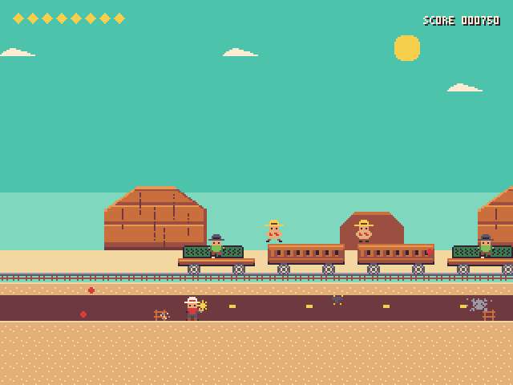
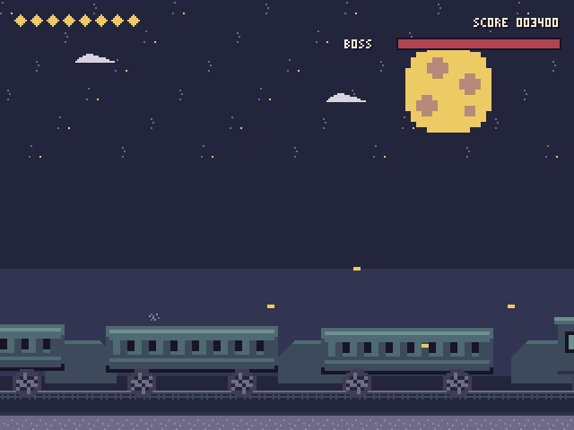
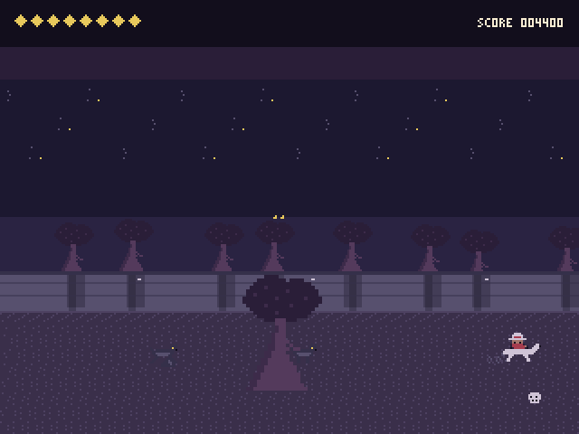
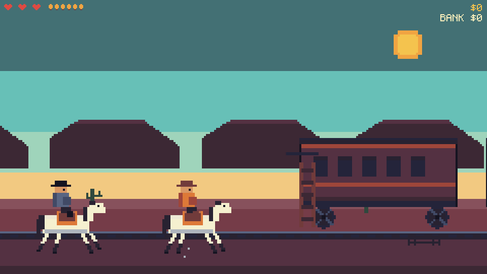

# TINY WEST 🤠🌵

A **Sunset Riders**–style run-and-gun tribute in a **single, fully self-contained HTML file**.
No CDN, no network requests, no build step required to play — open `index.html` and go.

  

## Play

Open `index.html` in any modern browser (double-click works — it runs from `file://`).

| Action | Keys |
| --- | --- |
| Move | Arrows / WASD |
| Jump | Z / K / Space |
| Fire | X / J / F |
| Fire upward | Hold ↑ + Fire |
| Start / Retry | Enter (or tap the canvas) |
| Pause | P / Esc |
| Mute | M |

Touch devices get on-screen pads automatically.

## The game

Three stages, each themed after a reference GIF:

1. **SUNDOWN EXPRESS** — daylight desert. Run past the held-up train, deal with bandits on the
   ground, gunners on the flatcars and roof-walkers on the cars. Boss at the end of the line.
2. **MIDNIGHT RUN** — night. Fight along the roof of a moving train; jump the gaps between cars
   (falling costs a heart), push forward to the locomotive for the boss.
3. **GHOST FOREST** — an auto-scrolling horseback ride through a dark wood: wolves, ambushers,
   glowing eyes between the trees and a river full of reflections. Final showdown at the end.

4 hearts, pickups (❤ heal, 🔫 rapid fire, ◆ score), per-stage bosses with HP bars, chiptune
SFX + music via WebAudio.

## How it's built

- **Java(Script) + React** — the page shell, HUD chrome and touch controls are a React 18 app
  (React + ReactDOM UMD builds are inlined into the HTML, so the file stays offline-capable);
  the game itself renders into a 320×240 canvas at a fixed 60 Hz timestep.
- **8×8 asset format** — every graphic is an 8×8 tile. Characters, the train, mesas and trees are
  *metasprites*: grids of 8×8 tiles (NES-style). The font is 8×8 tiles too (3×5 glyphs).
- **All graphics hardcoded in base64** — each tile is 64 pixels of 4-bit palette indices, packed
  two pixels per byte (32 bytes) and embedded as a base64 string. At boot they're decoded with
  `atob` into per-theme sprite atlases.
- **Palette-swap theming** — sprites store palette *slots*, not colors. The day / night / forest
  palettes recolor the entire world (the same train car is orange at noon and teal at midnight,
  exactly like the reference GIFs).

## Repo layout

```
index.html      the whole game — ship/play this one file
dev/sprites.js  art source (ASCII pixel grids) → 8×8 tiles → base64 encoder + PNG previewer
dev/game.js     game/React source embedded into index.html
dev/build.js    assembles index.html (inlines React UMD + assets + game)
docs/           screenshots
```

To rebuild after editing art or code:

```sh
cd dev
npm install react@18.3.1 react-dom@18.3.1 playwright   # once
node sprites.js emit   # regenerate base64 tile data (assets.js)
node build.js ../index.html
```

*(A note on the brief: "base 63" was interpreted as base64 — the standard binary-to-text
encoding: each tile is exactly 44 base64 characters.)*

---

# TINY WEST: RAMPAGE EXPRESS — 42-second vertical slice 🐎💰

The repo also contains the **current production direction**: a deterministic
480×270 arcade slice built from the [Tiny West Brain](docs/tiny-west-brain/README.md)
canon (`CHASE → BOARD → BLAST → CASH → RETURN → ESCAPE`).

**Play it:** open [`slice/dist/tiny-west.html`](slice/dist/tiny-west.html) — one offline file.



- Chase the train, ride the slipstream, hit the 36-frame boarding window (18-frame perfect).
- Clear the Dynamite Relay (shoot dynamite mid-air, or let it land next to the guard…).
- Blast two lock pins, grab the cash burst, leap back to your horse — clean, rough, or rope.
- Bank it, then choose: teal RIDE OUT (×1.25) or the gold PAY CAR ladder (Marshal, ×1.5).
- Seeded runs (`R` = retry same seed), medals, 3 hearts, 6-shot revolver with active reload.

Controls: arrows/WASD · Z/Space jump · X/J fire · P pause · M sound · 1/2/3 accessibility.
Dev docs: [`CLAUDE.md`](CLAUDE.md) · constants: [`docs/tiny-west-brain/CONSTANTS.md`](docs/tiny-west-brain/CONSTANTS.md)
· receipts: [`docs/tiny-west-brain/BUILD_RECEIPT_SLICE.md`](docs/tiny-west-brain/BUILD_RECEIPT_SLICE.md).
